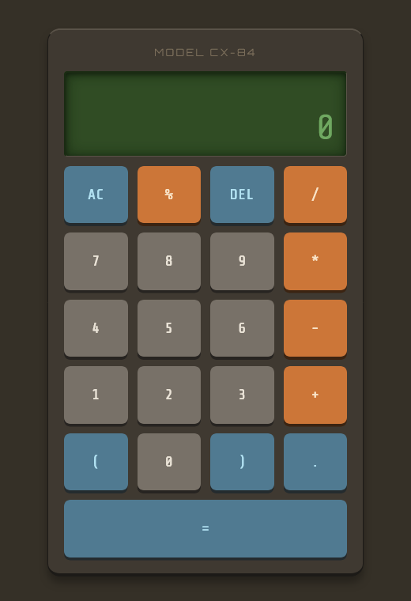

# Simple Calculator

Calculator built with vanilla JavaScript that supports basic arithmetic and operator precedence.

## Features

- Basic operations: addition, subtraction, multiplication, division and modulo
- Unary operators
- Parentheses support with correct precedence (shunting-yard algorithm)
- Keyboard support

## Preview

## Focus

Expression parsing, operator precedence and DOM manipulation
