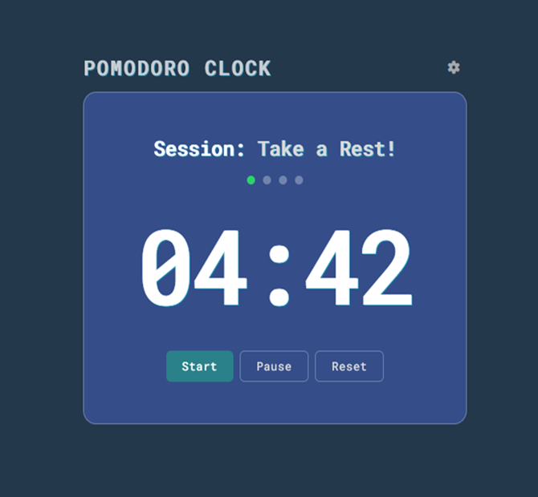

# Pomodoro Timer

Browser Pomodoro timer implementing work/break cycles.

## Features

- Start, pause and reset the timer
- Automatic switching between focus and break sessions
- Custom work, short/long break durations
- Visual session indicators (cycle tracking)
- Persistent configuration using localStorage

## Preview

## Focus

This project focuses on timer logic, UI state transitions, and DOM manipulation without external libraries.
